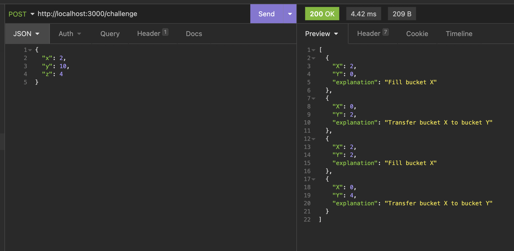
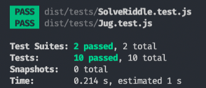

# Exercise

Water Jug Challenge

OVERVIEW
Build an application that solves the Water Jug Riddle for dynamic inputs (X, Y, Z). The
simulation should have a UI (if SPA) to display state changes for each state for each jug
(Empty, Full or Partially Full).
You have an X-gallon and a Y-gallon jug that you can fill from a lake. (Assume lake has unlimited amount
of water.) By using only an X-gallon and Y-gallon jug (no third jug), measure Z gallons of water.

GOALS

1. Measure Z gallons of water in the most efficient way.
2. Build a UI where a user can enter any input for X, Y, Z and see the solution.
3. If no solution, display “No Solution”.
   LIMITATIONS
   • Actions allowed: Fill, Empty, Transfer.

DELIVERABLES
The application source code should be on Github and a link should be provided. If this is not an
option, a public link to the application source code or a zip archive is also acceptable.

# How to run

Clone the project using the following command on your terminal:

    git clone https://github.com/GuiPimenta-Dev/water-jug-challenge

Enter in the folder:

    cd water-jug-challenge

## Using Docker

Build the container image with Docker:

    docker build -t water-jug .

Run the container

    docker run -d -p 3000:3000 water-jug

### Now the server is running on http://localhost:3000/

## Without Docker

Install the dependencies

    npm install

Run the server

    npm start

### Now the server is running on http://localhost:3000/

# Solving the challenge

Execute a Post to http://localhost:3000/challenge with the x, y and z as body parameters to solve the challenge.

    curl --request POST \
    --url http://localhost:3000/challenge \
    --header 'content-type: application/json' \
    --data '{
        "x": 2,
        "y": 10,
        "z": 4
    }'

# Response

  

 

# Tests

## The algoritm was tested using the Jest library to ensure it is working properly.

Run the tests with the following command:

    npm test

  

# Thanks for reading!

_Clean code always looks like it was written by someone who cares._

_Michael Feathers_
